# **Traffic Sign Recognition** 

---

Here is a link to my [project code](https://github.com/VolodymyrIvanov/Udacity-Traffic-Sign-Classifier/blob/master/Traffic_Sign_Classifier.ipynb)

### Data Set Summary & Exploration

#### 1. Basic summary of the data set.

I used the pandas library to calculate summary statistics of the traffic
signs data set:

* The size of training set is 34799
* The size of the validation set is 4410
* The size of test set is 12630
* The shape of a traffic sign image is (32, 32, 3)
* The number of unique classes/labels in the data set is 43

#### 2. Visualization of the dataset.

Here is an exploratory visualization of the data set.

##### Training Set

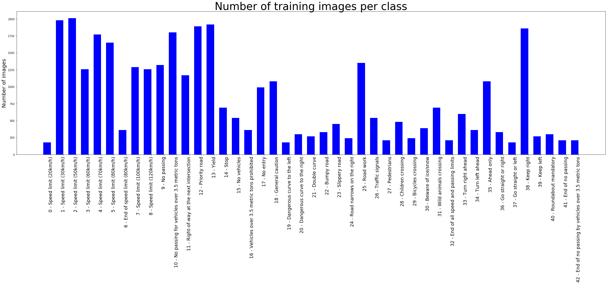

##### Validation Set

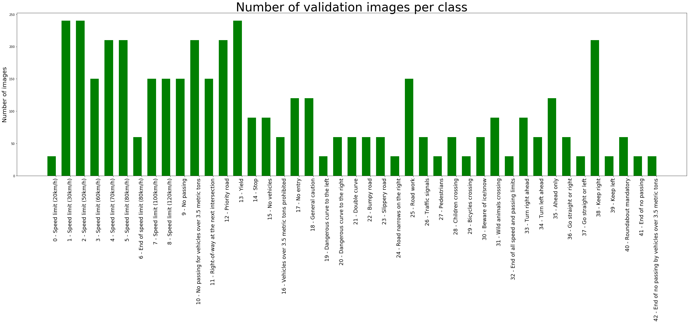

##### Test Set

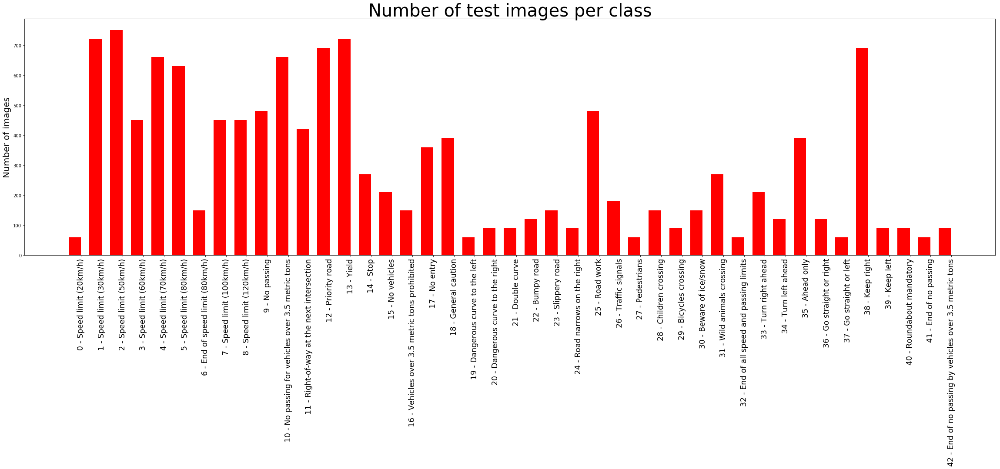

### Design and Test a Model Architecture

#### 1. Preprocessing of the image data

As a first step, I decided to convert the images to grayscale to decrease the difference factor
between images, but that step brought me pure validation accuracy (approx. 0.5 - 0.6) during 
training process. Therefore, I decided to proceed with colored images.

As a next step, I normalized the image data using proposed formula:
`pixel = (pixel - 128) / 128`
That brought me quite good results of validation accuracy - approx. 0.87 - 0.89. After testing of
this trained model on test set I got the accuracy 0.89 on provided test set and 0.8 on my new images set (4 from 5 images were predicted correct)

To improve the prediction and to reach minimal validation accuracy for a project I decided to generate additional data. 

To add more data to the the data set, I used the following techniques:
- rotation of image in interval -10 .. 10 degrees to emulate "shaking" effect of camera during car trip
- translation of image in maximum 10% of image width and height to emulate preprocessing of images between camera output (whole picture) and Computer Vision filtering like detection of sign shape in whole icture
- scaling of image by factor 0.7 to emulate different camera resolutions
- smoothing of image using kernel size equal to 10% of image size to emulate different camera errors

Here is an example of an original image and an augmented images:

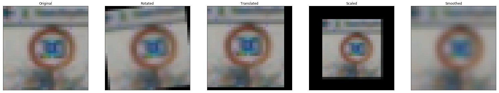

#### 2. Model architecture.

My final model consisted of the following layers:

| Layer         		|     Description	        					  	| 
|:---------------------:|:-------------------------------------------------:| 
| Input         		| 32x32x3 RGB image   							  	| 
| Convolution 5x5     	| 1x1 stride, valid padding, filtering 5x5,			|
|						| outputs 28x28x6 									|
| RELU					|													|
| Max pooling	      	| 2x2 stride, outputs 14x14x6		 				|
| Convolution 5x5     	| 1x1 stride, valid padding, filtering 5x5,			|
|						| outputs 10x10x6 									|
| RELU					|													|
| Max pooling	      	| 2x2 stride, outputs 5x5x6			 				|
| Flattening			| Outputs 400										|
| Fully connected	    | Inputs 400, outputs 120      						|
| RELU					|													|
| Fully connected		| Inputs 120, outputs 84							|
| RELU					|													|
| Fully connected		| Inputs 84, outputs 43 (number of classes)			|
 

#### 3. Training of model.

To train the model, I used following parameters:
- number of epochs 	- 20
- batch size 		- 128
- AdamOptimizer
- learning rate		- 0.001

#### 4. Approaching of minimal required validation set accuracy (0.93).

My final model results were:
* training set accuracy of 0.994
* validation set accuracy of 0.954 
* test set accuracy of 0.935

If an iterative approach was chosen:
* As the first architecture was chosen LeNet network as proposed in lecture materials. The architecture was tried on grayscaled training set. The results are not good enough (approx. validation accuracy 0.5 - 0.6) 
* As alternative the colored images was decided to use plus images were normalized using proposed in lecture formula. The validation accuracy reached level approx. 0.87 - 0.89.
* As a next step was decided to generate augmented images from training set (see preprocessing topic). At this step the accuracy reaches needed level.

### Test a Model on New Images

#### 1. Chosen five German traffic signs.

Here are five German traffic signs that I found on the web and made myself using smartphone camera:

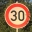 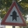 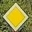 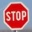 

The first image might be difficult to classify because in the training set there are several very similar signs with different speed limit values (20 km/h, 30 km/h, 50 km/h, etc.)
The second image might be difficult to classify because in the training set there are a group of the same sign by shape (triangle), but with different icons inside. 
The fifth image might be difficult to classify because in the training set there are a group of the same sign by shape (oval) and background (blue), but with different icons inside. 
The third and fourth signs are quite original by shape (diamont and octagon) and background color.

#### 2. Model's predictions.

Here are the results of the prediction:

 Image			         |     Prediction	        					 
-------------------------|--------------------------------------------- 
38,Keep right  			 | 38,Keep right
1,Speed limit (30km/h)	 | 1,Speed limit (30km/h) 
11,Right-of-way at the   | 11,Right-of-way at the 
next intersection        | next intersection
12,Priority road         | 12,Priority road
14,Stop                  | 14,Stop

The model was able to correctly guess all 5 of the 5 traffic signs, which gives an accuracy of 100%. This is even better, than the accuracy on the test set of 0.935

#### 3. Predictions of each five new images.

The code for making predictions on final model is located in the 64-th cell of the Ipython notebook.

For the image , the model is sure that this is a Speed Limit (30 km/h) sign (probability of 1.0), and the image does contain a Speed Limit (30 km/h) sign. The top five soft max probabilities were

| Probability         	|     Prediction	        					| 
|:---------------------:|:---------------------------------------------:| 
| 1.0         			| Speed Limit (30 km/h)  						| 
| 1.22196518e-34		| Speed Limit (20 km/h)							|
| .0					| Speed Limit (120 km/h)						|
| .0	      			| Speed Limit (150 km/h)		 				|
| .0				    | Keep right	      							|

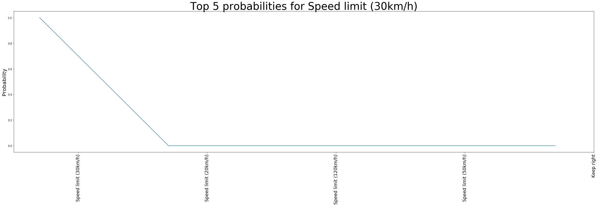

For the image , the model is sure that this is a Right of way in the next intersection sign (probability of 1.0), and the image does contain a Right of way in the next intersection sign. The top five soft max probabilities were

| Probability         	|     Prediction	        					| 
|:---------------------:|:---------------------------------------------:| 
| 1.0         			| Speed Limit (30 km/h)  						| 
| 2.32788100e-09		| Beware of ice/snow							|
| 4.96778428e-15		| Children crossing								|
| 4.93515905e-17		| Ahead only  									|
| 8.14442600e-19		| Double curve									|

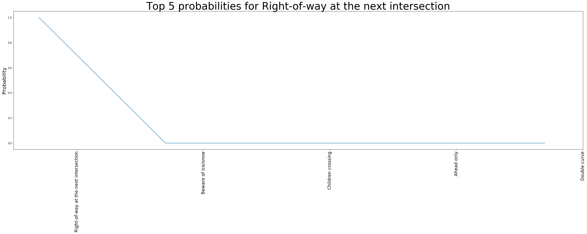

For the image , the model is sure that this is a Priority road sign (probability of 1.0), and the image does contain a Priority road sign. The top five soft max probabilities were

| Probability         	|     Prediction	        					| 
|:---------------------:|:---------------------------------------------:| 
| 1.0         			| Priority road			  						| 
| 3.99274225e-10		| Stop											|
| 6.70022197e-13		| Speed Limit (80 km/h)							|
| 1.12960626e-13		| Speed Limit (20 km/h)							|
| 8.01911163e-14		| Speed Limit (30 km/h)							|

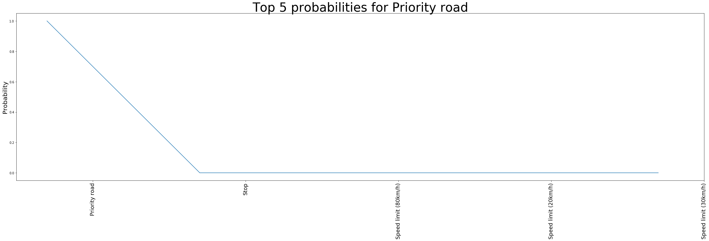

For the image , the model is sure that this is a Stop sign (probability of 1.0), and the image does contain a Stop road sign. The top five soft max probabilities were

| Probability         	|     Prediction	        					| 
|:---------------------:|:---------------------------------------------:| 
| 1.0         			| Stop					  						| 
| 4.37510650e-08		| No entry										|
| 1.52804761e-14		| Speed Limit (20 km/h)							|
| 4.19465075e-17		| Speed Limit (30 km/h)							|
| 4.08169016e-19		| Speed Limit (50 km/h)							|

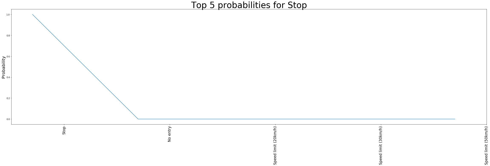

For the image , the model is sure that this is a Keep right sign (probability of 1.0), and the image does contain a Keep right road sign. The top five soft max probabilities were

| Probability         	|     Prediction	        					| 
|:---------------------:|:---------------------------------------------:| 
| 1.0         			| Keep right			  						| 
| 1.08259033e-31		| Turn left ahead								|
| 2.55939915e-32		| Speed Limit (20 km/h)							|
| .0					| Speed Limit (30 km/h)							|
| .0					| Speed Limit (50 km/h)							|

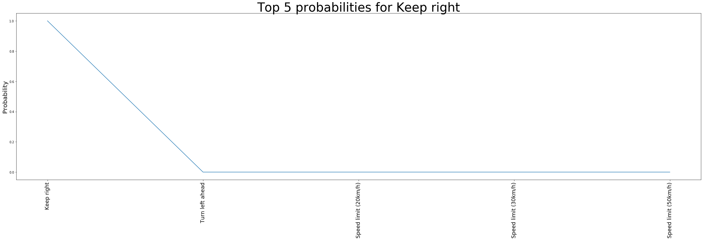

The HTML output file with all Cells output data is placed here: [HTML file](html_out/2017-08-08/Traffic_Sign_Classifier.html)
